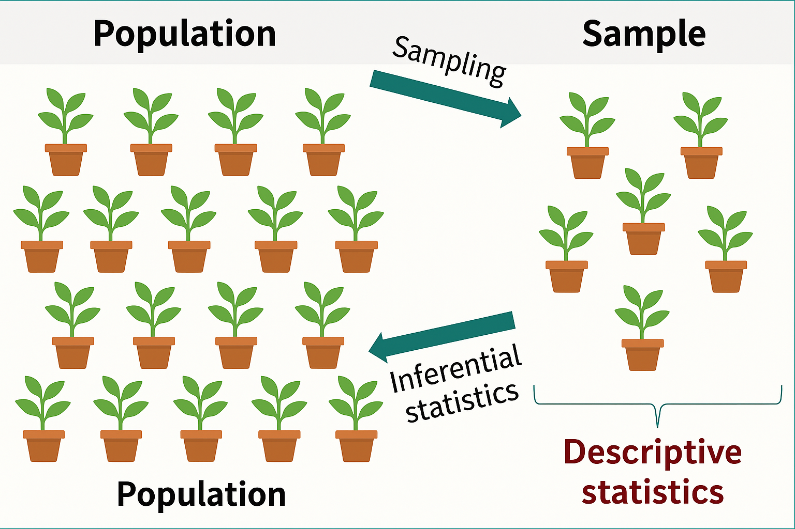
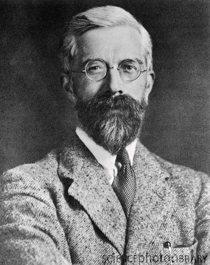
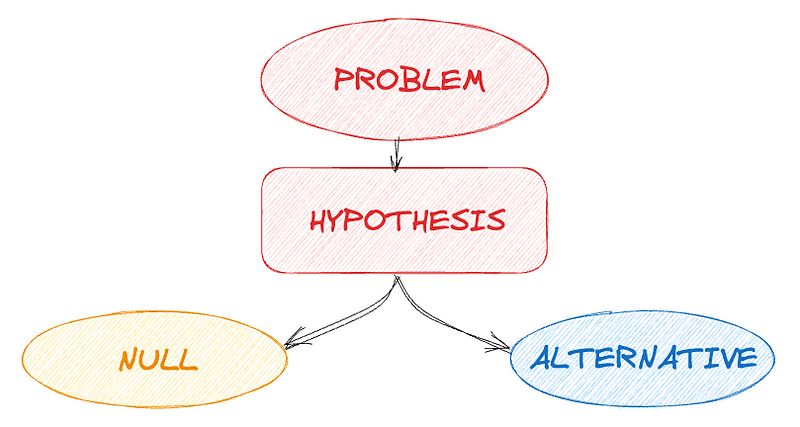
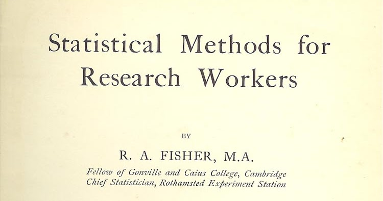
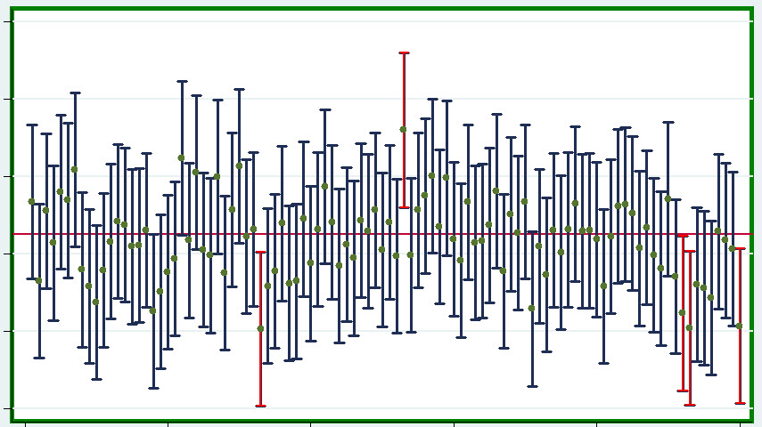
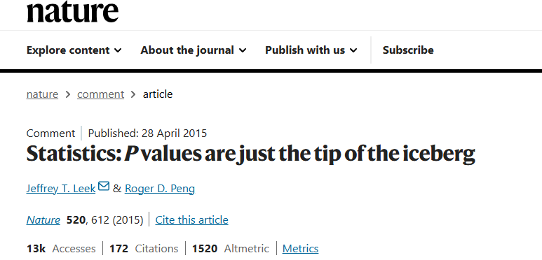
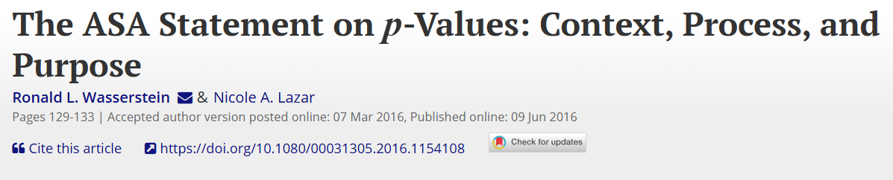

## Inferencia
<html>

 

## El problema: Inglaterra, 1919
<html>

**Rothamsted Experimental Station**

- Estación agrícola más antigua del mundo (1843)
- Décadas de datos de experimentos agrícolas acumulados
- **Pregunta central:** ¿Cómo decidir objetivamente si un tratamiento funciona?

## Ronald Fisher (1890-1962)
<html>

- Contratado en 1919 para analizar datos históricos
- Desarrolló ANOVA y diseño experimental moderno
- Creador de la estadística aplicada moderna

## La solución: Hipótesis Nula (H₀)
<html>

:::: {.columns}

::: {.column width="60%"}
 
 

- **H₀:** La posición por defecto, el "no pasa nada"
  - "No hay diferencia entre tratamientos"
  - "El efecto es cero"
  - Lo que queremos refutar con datos

- **H₁:** La hipótesis alternativa
  - "Sí hay diferencia"
  - "El tratamiento tiene efecto"
:::

::: {.column width="40%"}

 
 
 
 

:::

::::

## El Valor P (1925)
<html>

**"Statistical Methods for Research Workers"**

*"¿Qué tan probable es observar estos datos (o más extremos) si H₀ fuera cierta?"*

- Un **índice de evidencia** continuo
- NO una regla de decisión automática
- Cuanto menor el p, más evidencia contra H₀

## Interpretando el Valor P
<html>

- **p < 0.001:** muy improbable bajo H₀ → fuerte evidencia de efecto
- **p = 0.40:** bastante probable bajo H₀ → poca evidencia

**⚠️ El valor p NO es:**

- La probabilidad de que H₀ sea verdadera
- La probabilidad de error

## Jerzy Neyman (1894-1981)
<html>

- Matemático polaco, años 1930s
- Propuso los **Intervalos de Confianza** (1934-1937)
- Filosofía diferente: procedimientos de decisión a largo plazo

## La limitación del valor p
<html>

**El valor p responde:** ¿Hay evidencia de efecto?

**NO responde:**

- ¿Qué tan grande es el efecto?
- ¿Qué valores son plausibles?
- ¿Cuál es mi incertidumbre?

**Necesidad:** cuantificar incertidumbre constructivamente

## Intervalos de Confianza
<html>

**De estimación puntual a intervalo:**

- Puntual: β = 150
- Intervalo 95%: [135, 165]

**Interpretación correcta:**

*"El 95% de intervalos construidos capturarían el valor verdadero"*

**⚠️ NO:** "95% de probabilidad de que β esté ahí"

## Visualización de IC
<html>

**100 experimentos repetidos - IC del 95%**

- ~95 intervalos capturan el valor verdadero
- ~5 intervalos fallan
- El parámetro es fijo, el intervalo es aleatorio

## Fisher vs Neyman
<html>

**Resultado:** enemistad que duró décadas

Ambos enfoques aportan, ninguno es "el correcto"

:::: {.columns}

::: {.column width="50%"}
**Fisher**

Evidencia continua, flexible

:::

::: {.column width="50%"}
**Neyman**

Procedimientos de decisión, propiedades a largo plazo

:::

::::

## El problema de p = 0.05
<html>

- Neyman lo propuso para **decisiones urgentes**
- Se universalizó incorrectamente como regla absoluta
- p = 0.049 vs p = 0.051 no tienen diferencia práctica
- **El umbral es arbitrario**

## Problemas modernos
<html>

- **P-hacking:** manipular análisis para p < 0.05
- **HARKing:** inventar hipótesis después de ver resultados
- **Sesgo de publicación:** solo se publica lo "significativo"
- **Crisis de replicación:** muchos hallazgos no se replican

## Declaración ASA (2016)
<html>

**American Statistical Association:**

1. El valor p NO mide si H₀ es verdadera
2. NO indica tamaño del efecto
3. NO es buena medida de evidencia por sí solo
4. Cruzar p = 0.05 no significa "verdad"

**Las decisiones científicas requieren más que valores p**

## Recomendación: enfoque integrado
<html>

1. **Contexto del dominio**
2. **Visualización** de datos y ajuste de modelos
3. **Intervalos de confianza**
4. **Tamaño del efecto**
5. **Valor p** (como índice, no como regla)

**Ninguna métrica cuenta toda la historia**

## Consideraciones importantes
<html>

- Valor p = índice de evidencia, no verdad
- IC = cuantificación de incertidumbre
- p = 0.05 es arbitrario
- Siempre reportar tamaño del efecto e IC
- Contexto y relevancia práctica son fundamentales
- **La estadística es una herramienta instrumental, no tiene caracter ontológico**

## ¡Gracias!
<html>

 

