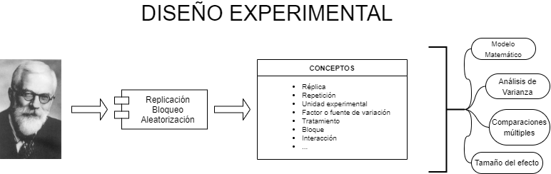

## Inferencia Estadística {.scrollable .smaller}
<html>

</html> 

### Base para el diseño experimental

La inferencia estadística proporciona las herramientas necesarias para diseñar experimentos que permitan obtener conclusiones válidas sobre poblaciones a partir de muestras.

{fig-align="center"}

### Conexión con inferencia:
- **Estimación:** determinar parámetros poblacionales
- **Pruebas de hipótesis:** comparar tratamientos
- **Intervalos de confianza:** cuantificar incertidumbre
- **Potencia:** capacidad de detectar diferencias

## ¿Cómo comparar más de 2 grupos? {.scrollable .smaller}
<html>

</html> 

### Análisis de varianza (ANOVA)

Cuando tenemos más de dos grupos para comparar, el ANOVA es la herramienta estadística apropiada:

$$y_{ij} = \mu + \tau_j + \epsilon_{ij}$$

### Componentes del modelo:

- **$y_{ij}$:** variable respuesta o dependiente
- **$\mu$:** media general (gran media)
- **$\tau_{j}$:** efecto del $j-ésimo$ tratamiento
- **$\epsilon_{ij}$:** error aleatorio experimental

### Supuestos:
- **Normalidad:** $\epsilon_{ij} \sim N(\mu=0,\sigma^2)$
- **Homocedasticidad:** varianza constante
- **Independencia:** observaciones no correlacionadas

{fig-align="center"}

# Tipos de diseños {.scrollable .smaller}
<html>

</html> 

### Clasificación fundamental

Los diseños experimentales se clasifican según:
- **Número de factores:** un factor, factorial, mixto
- **Estructura:** completamente aleatorizado, en bloques, parcelas divididas
- **Objetivo:** exploratorio, confirmatorio, optimización

{fig-align="center"}

### Principios fundamentales:
1. **Replicación:** incrementa precisión
2. **Aleatorización:** reduce sesgo
3. **Bloqueo:** controla variabilidad
4. **Balance:** igual número de observaciones por tratamiento

## Diseño Completamente al Azar (DCA) {.scrollable .smaller}
<html>

</html> 

### Estructura más simple

El DCA es el diseño más básico donde todas las unidades experimentales tienen igual probabilidad de recibir cualquier tratamiento:

$$y_{ij} = \mu + \tau_j + \epsilon_{ij}$$

### Características:

- **$y_{ij}$:** variable respuesta o dependiente
- **$\mu$:** media general
- **$\tau_{j}$:** efecto del $j-ésimo$ tratamiento
- **$\epsilon_{ij}$:** error aleatorio experimental

### Ventajas:
- **Simplicidad:** fácil implementación y análisis
- **Flexibilidad:** cualquier número de tratamientos y réplicas
- **Eficiencia:** máxima utilización de unidades experimentales

### Desventajas:
- **Sensibilidad:** no controla variabilidad entre unidades
- **Precisión:** puede ser menor que otros diseños
- **Aplicabilidad:** requiere unidades homogéneas

## Diseño en Bloques al Azar (DBA) {.scrollable .smaller}
<html>

</html> 

### Control de variabilidad

El DBA extiende el DCA al considerar bloques que agrupan unidades experimentales similares:

$$y_{ijk} = \mu + \tau_j + \beta_k + \epsilon_{ijk}$$

### Componentes del modelo:

- **$y_{ijk}$:** variable respuesta o dependiente
- **$\mu$:** media general
- **$\tau_{j}$:** efecto del $j-ésimo$ tratamiento
- **$\beta_k$:** efecto del $k-ésimo$ bloque
- **$\epsilon_{ijk}$:** error aleatorio experimental

### Aplicaciones:
- **Campo:** bloques por fertilidad del suelo
- **Laboratorio:** bloques por lote de material
- **Animales:** bloques por peso inicial
- **Tiempo:** bloques por período experimental

### Ventajas:
- **Control:** reduce variabilidad no controlada
- **Precisión:** mayor sensibilidad para detectar diferencias
- **Eficiencia:** mejor estimación de efectos de tratamientos

## Diseños factoriales {.scrollable .smaller}
<html>

</html> 

### Múltiples factores simultáneos

Los diseños factoriales permiten estudiar múltiples factores y sus interacciones en un solo experimento:

{fig-align="center"}

### Tipos de modelos:

#### Modelo aditivo:
$$y_{ij...} = \mu + \tau_j + \tau_j + ... + \tau_j + \epsilon_{ij...}$$

#### Modelo multiplicativo (con interacciones):
$$y_{ij...} = \mu + (\tau \tau)_{jk} + ... + \epsilon_{ij...}$$

### Ventajas:
- **Eficiencia:** más información por unidad experimental
- **Interacciones:** detecta efectos combinados
- **Generalización:** resultados aplicables a más condiciones
- **Economía:** menor número total de experimentos

### Desventajas:
- **Complejidad:** análisis más sofisticado
- **Interpretación:** interacciones pueden ser complejas
- **Tamaño:** puede requerir muchas unidades experimentales

## Representación de diseños factoriales {.scrollable .smaller}
<html>

</html> 

### Visualización geométrica

Los diseños factoriales se representan geométricamente según el número de factores:

{fig-align="center"}

### Tipos de representación:

1. **Factorial 2²:** cuadrado con 4 puntos
2. **Factorial 2³:** cubo con 8 puntos
3. **Factorial 3²:** cuadrado con 9 puntos
4. **Factorial mixto:** combinación de niveles

### Notación:
- **2²:** 2 factores, 2 niveles cada uno
- **3³:** 3 factores, 3 niveles cada uno
- **2×3:** 2 factores, uno con 2 niveles, otro con 3

## Diseños de parcelas divididas {.scrollable .smaller}
<html>

</html> 

### Factores con diferentes niveles de precisión

Los diseños de parcelas divididas se usan cuando:
- Un factor requiere mayor precisión (parcelas principales)
- Otro factor puede ser menos preciso (subparcelas)
- Hay limitaciones logísticas o prácticas

### Estructura del modelo:

$$y_{ijk} = \mu + \alpha_i + \beta_j + (\alpha\beta)_{ij} + \epsilon_{ijk}$$

### Componentes:
- **$\alpha_i$:** efecto del $i-ésimo$ nivel del factor principal
- **$\beta_j$:** efecto del $j-ésimo$ nivel del factor secundario
- **$(\alpha\beta)_{ij}$:** interacción entre factores
- **$\epsilon_{ijk}$:** error experimental

### Aplicaciones:
- **Agricultura:** variedad (parcela principal) × fertilización (subparcela)
- **Animales:** raza (grupo principal) × alimentación (individual)
- **Laboratorio:** lote (principal) × concentración (secundario)

## Diseños de medidas repetidas {.scrollable .smaller}
<html>

</html> 

### Observaciones correlacionadas en el tiempo

Los diseños de medidas repetidas se usan cuando:
- Se miden las mismas unidades en múltiples momentos
- Las observaciones están correlacionadas temporalmente
- Se quiere estudiar efectos de tratamientos a lo largo del tiempo

### Estructura del modelo:

$$y_{ijk} = \mu + \alpha_i + \beta_j + (\alpha\beta)_{ij} + \pi_k + \epsilon_{ijk}$$

### Componentes:
- **$\alpha_i$:** efecto del $i-ésimo$ tratamiento
- **$\beta_j$:** efecto del $j-ésimo$ tiempo
- **$(\alpha\beta)_{ij}$:** interacción tratamiento × tiempo
- **$\pi_k$:** efecto del $k-ésimo$ individuo
- **$\epsilon_{ijk}$:** error residual

### Aplicaciones:
- **Crecimiento:** peso de animales en el tiempo
- **Rendimiento:** producción de cultivos por estación
- **Calidad:** parámetros de calidad durante almacenamiento

## Análisis de varianza (ANOVA) {.scrollable .smaller}
<html>

</html> 

### Descomposición de la variabilidad

El ANOVA descompone la variabilidad total en componentes atribuibles a diferentes fuentes:

### Tabla ANOVA típica:

| Fuente | Grados de Libertad | Suma de Cuadrados | Cuadrado Medio | F | p-valor |
|--------|-------------------|-------------------|----------------|----|---------|
| Tratamientos | $t-1$ | $SST$ | $MST = SST/(t-1)$ | $MST/MSE$ | $p$ |
| Error | $N-t$ | $SSE$ | $MSE = SSE/(N-t)$ | | |
| Total | $N-1$ | $SSTotal$ | | | |

### Estadístico F:
$$F = \frac{MST}{MSE}$$

### Interpretación:
- **F grande:** evidencia de diferencias entre tratamientos
- **p < α:** rechazar hipótesis nula de igualdad
- **F pequeño:** poca evidencia de diferencias

## Comparaciones múltiples {.scrollable .smaller}
<html>

</html> 

### Identificación de diferencias específicas

Cuando el ANOVA es significativo, se requieren métodos para identificar qué tratamientos difieren:

### Métodos comunes:

1. **Tukey HSD (Honestly Significant Difference):**
   - Controla error tipo I para todas las comparaciones
   - Conservador pero confiable
   - Apropiado para comparaciones exploratorias

2. **Duncan Multiple Range Test:**
   - Menos conservador que Tukey
   - Agrupa tratamientos no significativamente diferentes
   - Útil para clasificación de tratamientos

3. **Contrastes ortogonales:**
   - Comparaciones planificadas específicas
   - Máxima potencia para hipótesis a priori
   - Requiere conocimiento previo de la estructura

### Interpretación:
- **Letras diferentes:** tratamientos significativamente diferentes
- **Mismas letras:** tratamientos no significativamente diferentes
- **Grupos:** tratamientos estadísticamente equivalentes

## Validación de supuestos {.scrollable .smaller}
<html>

</html> 

### Verificación de condiciones del ANOVA

### Supuestos fundamentales:

1. **Normalidad:**
   - **Verificación:** Q-Q plots, tests de Shapiro-Wilk
   - **Solución:** transformaciones, métodos no paramétricos

2. **Homocedasticidad:**
   - **Verificación:** test de Levene, Bartlett
   - **Solución:** transformaciones, modelos de varianza heterogénea

3. **Independencia:**
   - **Verificación:** diseño experimental, tests de autocorrelación
   - **Solución:** diseño apropiado, modelos de correlación

4. **Aditividad:**
   - **Verificación:** gráficos de interacción
   - **Solución:** modelos con interacciones, transformaciones

### Métodos alternativos:
- **Kruskal-Wallis:** alternativa no paramétrica al ANOVA
- **Modelos lineales mixtos:** manejan correlaciones y heterogeneidad
- **Bootstrap:** estimación robusta de intervalos de confianza

## Casos prácticos en agropecuaria {.scrollable .smaller}
<html>

</html> 

### Ejemplos reales de aplicación

### Producción animal:

- **Comparación de dietas:**
  - Tratamientos: 4 tipos de alimentación
  - Diseño: DCA con 6 réplicas por tratamiento
  - Respuesta: ganancia de peso diaria
  - Análisis: ANOVA unidireccional

- **Efecto de suplementos:**
  - Tratamientos: control, suplemento A, suplemento B
  - Diseño: DBA (bloques por peso inicial)
  - Respuesta: producción de leche
  - Análisis: ANOVA en bloques

### Agricultura:

- **Efecto de fertilizantes:**
  - Tratamientos: 3 niveles de NPK
  - Diseño: factorial 3² (N × P)
  - Respuesta: rendimiento de maíz
  - Análisis: ANOVA factorial

- **Variedades y riego:**
  - Factores: variedad (3 niveles), riego (2 niveles)
  - Diseño: parcelas divididas
  - Respuesta: altura de plantas
  - Análisis: ANOVA de parcelas divididas

## Interpretación de resultados {.scrollable .smaller}
<html>

</html> 

### Análisis de salidas del ANOVA

### Elementos clave a interpretar:

1. **Estadístico F y p-valor:**
   - **F significativo (p < 0.05):** evidencia de diferencias
   - **F no significativo (p ≥ 0.05):** no hay evidencia de diferencias

2. **Coeficiente de determinación (R²):**
   - **R² alto (> 0.7):** el modelo explica mucha variabilidad
   - **R² bajo (< 0.3):** el modelo explica poca variabilidad

3. **Comparaciones múltiples:**
   - **Letras diferentes:** tratamientos estadísticamente diferentes
   - **Mismas letras:** tratamientos estadísticamente equivalentes

4. **Supuestos:**
   - **Residuales normales:** Q-Q plots sin desviaciones
   - **Homocedasticidad:** residuales vs fitted sin patrones

### Presentación de resultados:
- **Tabla ANOVA:** incluir grados de libertad, F, p-valor
- **Medias y errores estándar:** para cada tratamiento
- **Comparaciones múltiples:** grupos de tratamientos
- **Gráficos:** boxplots, barras de error, diagramas de interacción

## ¡Gracias! {.scrollable .smaller}

<html>

</html> 

