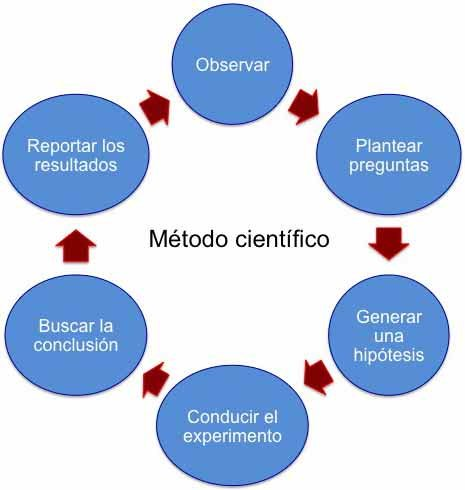
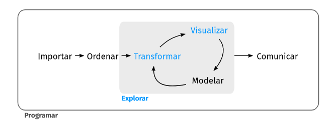
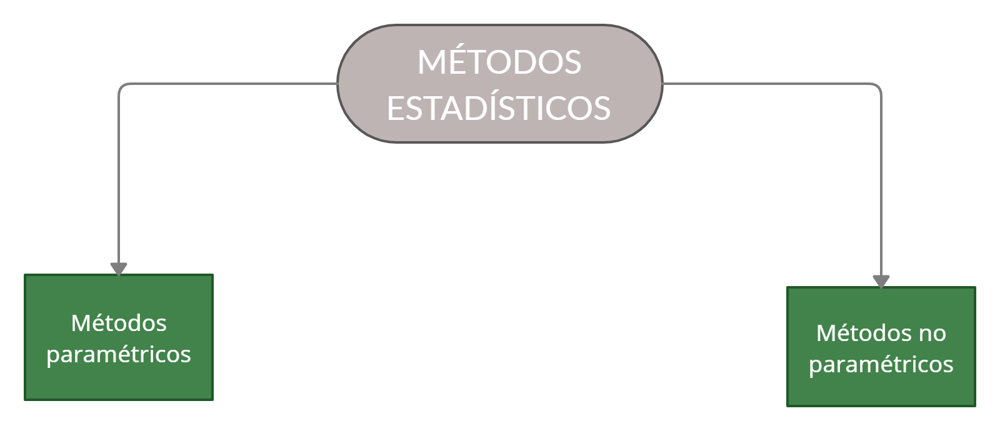

## Método científico
<html>

</html> 

{fig-align="center"}

## Método PPDAC
<html>

</html> 

- [The Statistical Method - PPDAC](https://www.statsref.com/HTML/statistics__statistical_analys.html)

{fig-align="center"}

## Inferencia estadística
<html>

</html>

{fig-align="center"}

## Proceso de análisis de datos
<html>

</html> 

{fig-align="center"}

## Manejo de datos
<html>

</html> 

{fig-align="center"}

## Exploración de datos
<html>

</html> 

{fig-align="center"}

## Modelación
<html>

</html> 

{fig-align="center"}

## Planificación {.scrollable  .smaller}
<html>

</html> 

::: {.incremental}

- **Objetivo del estudio:** ¿Qué esperan aprender o entender las partes interesadas en el experimento?
- **Selección de respuestas:** ¿Qué variable (s) se utilizarán para evaluar el objetivo del estudio?
- **Selección de tratamientos y otras covariables:**
  - **Factor:** variable que se cree afectará a la variable respuesta
  - **Tipos de factores:** cuantitativos y cualitativos
  - **Factores cuantitativos:** toman valores en un rango continuo
  - **Factores cualitativos:** los valores de una factor se denominan niveles, un **tratamiento** es un nivel del factor o una combinación de niveles de varios factores
- **Desarrollar un plan de estudio:** ¿Cómo se recopilarán los datos? ¿Cada cuánto se realizarán mediciones? ¿Quién es la **unidad experimental**?
- **Recopilación de datos:** describa con detalle los valores reales de los factores y cómo se registrará la variable respuesta
- **Análisis de datos:** realice análisis de datos para evaluar la relación entre los factores y las variables respuesta.
- **Extraer conclusiones:** el análisis de datos deberá ser de utilidad para extraer conclusiones, armar conjeturas o nuevas hipótesis y establecer recomendaciones.

:::

## Algunas preguntas de interés... {.scrollable .smaller}
<html>

</html> 

::: columns

::: {.column width="50%"}

- ¿Cuál es la proporción de semillas germinadas para la marca *X*?
- ¿Existen diferencias en la proporción de frutas afectadas para dos casas comerciales que proveen un producto que inhibe el efecto de plagas?
- ¿Cuál es el promedio del rendimiento (en toneladas por hectárea) para el cultivo de café en Colombia?
- ¿Existen diferencias en el promedio de producción de leche al suministrar el *aditivo A* vs *aditivo B* en la dieta de las vacas?
- ¿Existe alguna relación entre la cantidad de forraje verde consumido vs la producción de leche?
- ¿Existe alguna relación entre la edad de parto y el peso de los animales?

:::

::: {.column width="50%"}

{fig-align="center"}

{fig-align="center"}

:::

:::

## Tipos de modelos
<html>

</html> 

{fig-align="center"}

## Tipos de métodos estadísticos
<html>

</html> 

{fig-align="center"}

## Diseño experimental {.smaller}
<html>

</html> 

::: {.panel-tabset}

### Principios

::: columns

::: {.column width="50%"}

#### ¿Por qué hacer un experimento?

- Determinar las principales causas de variación en una respuesta medida
- Encontrar las condiciones que dan lugar a una respuesta máxima o mínima
- Obtener un modelo matemático para predecir respuestas futuras

#### Técnicas fundamentales

- Replicación `->`  Incrementa precisión
- Bloqueo `->` Incrementa precisión
- Aleatorización `->` Reduce el sesgo

:::

::: {.column width="50%"}

 

:::

:::

### Conceptos

- Réplica
- Repetición
- Unidad experimental
- Factor (fuente de variación)
- Tratamiento
- Bloque
- Efectos aditivos
- Efectos multiplicativos (interacción)

:::

## ¡Gracias!
<html>

</html> 

{fig-align="center"}