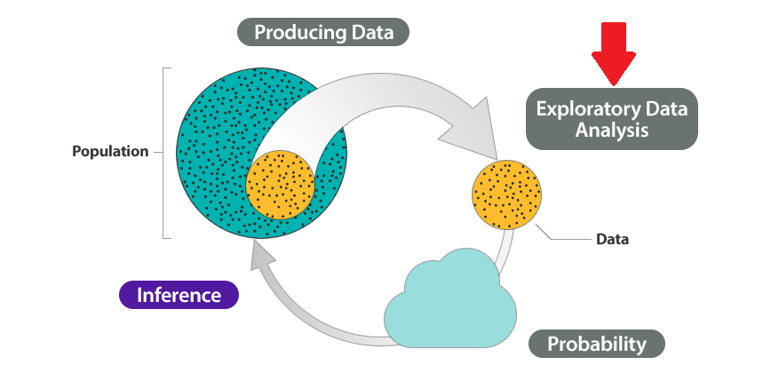

## ¿Para qué me sirve la regresión? 💡 {.smaller}
<html><div style='float:left'></div><hr color='#EB811B' size=1px></html> 

:::: {.columns}

::: {.column width="50%"}

```{r}
#| echo: false
#| fig-width: 5
#| fig-height: 5
#| fig-align: center

# Cargar librerías necesarias
library(ggplot2)

# Datos simulados de rendimiento de maíz vs dosis de fertilizante NPK
set.seed(123)
dosis_npk <- seq(0, 300, by = 20)
rendimiento <- 2.5 + 0.015 * dosis_npk + rnorm(length(dosis_npk), 0, 0.3)

datos_maiz <- data.frame(
  dosis_npk = dosis_npk,
  rendimiento = rendimiento
)

# Gráfico de dispersión con regresión lineal
ggplot(datos_maiz, aes(x = dosis_npk, y = rendimiento)) +
  geom_point(size = 2, color = "#2E8B57", alpha = 0.7) +
  geom_smooth(method = "lm", se = TRUE, color = "#FF6B35", linewidth = 1) +
  labs(
    title = "Regresión Lineal",
    x = "Dosis de NPK (kg/ha)",
    y = "Rendimiento (ton/ha)"
  ) +
  theme_minimal() +
  theme(
    plot.title = element_text(size = 14, face = "bold", hjust = 0.5),
    axis.title = element_text(size = 12),
    axis.text = element_text(size = 10)
  )
```

:::

::: {.column width="50%"}

```{r}
#| echo: false
#| fig-width: 5
#| fig-height: 5
#| fig-align: center

# Datos simulados con respuesta no lineal (curva de respuesta)
set.seed(123)
dosis_npk_nl <- seq(0, 400, by = 20)
rendimiento_nl <- 2.5 + 0.025 * dosis_npk_nl - 0.00004 * dosis_npk_nl^2 + rnorm(length(dosis_npk_nl), 0, 0.2)

datos_maiz_nl <- data.frame(
  dosis_npk = dosis_npk_nl,
  rendimiento = rendimiento_nl
)

# Gráfico de dispersión con regresión no lineal
ggplot(datos_maiz_nl, aes(x = dosis_npk, y = rendimiento)) +
  geom_point(size = 2, color = "#2E8B57", alpha = 0.7) +
  geom_smooth(method = "loess", se = TRUE, color = "#FF6B35", linewidth = 1) +
  labs(
    title = "Regresión No Lineal",
    x = "Dosis de NPK (kg/ha)",
    y = "Rendimiento (ton/ha)"
  ) +
  theme_minimal() +
  theme(
    plot.title = element_text(size = 14, face = "bold", hjust = 0.5),
    axis.title = element_text(size = 12),
    axis.text = element_text(size = 10)
  )
```

:::

::::

## ¿Para qué me sirve la regresión? 💡 {.smaller}
<html><div style='float:left'></div><hr color='#EB811B' size=1px></html> 

:::: {.columns}

::: {.column width="50%"}

```{r}
#| echo: false
#| fig-width: 5
#| fig-height: 5
#| fig-align: center

# Cargar librerías necesarias
library(ggplot2)

# Datos simulados de densidad de siembra vs rendimiento por planta
set.seed(789)
densidad <- seq(20, 120, by = 8)
rendimiento_planta <- 0.8 - 0.004 * densidad + rnorm(length(densidad), 0, 0.05)

datos_densidad <- data.frame(
  densidad = densidad,
  rendimiento_planta = rendimiento_planta
)

# Gráfico de dispersión con regresión lineal
ggplot(datos_densidad, aes(x = densidad, y = rendimiento_planta)) +
  geom_point(size = 2, color = "#4682B4", alpha = 0.7) +
  geom_smooth(method = "lm", se = TRUE, color = "#FF6B35", linewidth = 1) +
  labs(
    title = "Regresión Lineal",
    x = "Densidad de siembra (plantas/m²)",
    y = "Rendimiento por planta (kg)"
  ) +
  theme_minimal() +
  theme(
    plot.title = element_text(size = 14, face = "bold", hjust = 0.5),
    axis.title = element_text(size = 12),
    axis.text = element_text(size = 10)
  )
```

:::

::: {.column width="50%"}

```{r}
#| echo: false
#| fig-width: 5
#| fig-height: 5
#| fig-align: center

# Datos simulados con respuesta no lineal (competencia exponencial)
set.seed(789)
densidad_nl <- seq(20, 140, by = 8)
rendimiento_planta_nl <- 0.8 * exp(-0.012 * densidad_nl) + rnorm(length(densidad_nl), 0, 0.03)

datos_densidad_nl <- data.frame(
  densidad = densidad_nl,
  rendimiento_planta = rendimiento_planta_nl
)

# Gráfico de dispersión con regresión no lineal
ggplot(datos_densidad_nl, aes(x = densidad, y = rendimiento_planta)) +
  geom_point(size = 2, color = "#4682B4", alpha = 0.7) +
  geom_smooth(method = "loess", se = TRUE, color = "#FF6B35", linewidth = 1) +
  labs(
    title = "Regresión No Lineal",
    x = "Densidad de siembra (plantas/m²)",
    y = "Rendimiento por planta (kg)"
  ) +
  theme_minimal() +
  theme(
    plot.title = element_text(size = 14, face = "bold", hjust = 0.5),
    axis.title = element_text(size = 12),
    axis.text = element_text(size = 10)
  )
```

:::

::::

## ¿Para qué me sirve la regresión? 💡 {.smaller}
<html><div style='float:left'></div><hr color='#EB811B' size=1px></html> 

:::: {.columns}

::: {.column width="50%"}

```{r}
#| echo: false
#| fig-width: 5
#| fig-height: 5
#| fig-align: center

# Cargar librerías necesarias
library(ggplot2)

# Datos simulados de dosis de insecticida vs conteo de plagas
set.seed(456)
dosis_insecticida <- seq(0, 200, by = 15)
conteo_plagas <- 150 - 0.6 * dosis_insecticida + rnorm(length(dosis_insecticida), 0, 8)

datos_plagas <- data.frame(
  dosis_insecticida = dosis_insecticida,
  conteo_plagas = conteo_plagas
)

# Gráfico de dispersión con regresión lineal inversa
ggplot(datos_plagas, aes(x = dosis_insecticida, y = conteo_plagas)) +
  geom_point(size = 2, color = "#8B0000", alpha = 0.7) +
  geom_smooth(method = "lm", se = TRUE, color = "#FF6B35", linewidth = 1) +
  labs(
    title = "Regresión Lineal",
    x = "Dosis de insecticida (ml/ha)",
    y = "Conteo de plagas (individuos)"
  ) +
  theme_minimal() +
  theme(
    plot.title = element_text(size = 14, face = "bold", hjust = 0.5),
    axis.title = element_text(size = 12),
    axis.text = element_text(size = 10)
  )
```

:::

::: {.column width="50%"}

```{r}
#| echo: false
#| fig-width: 5
#| fig-height: 5
#| fig-align: center

# Datos simulados con respuesta no lineal en forma de U (efecto hormético + resistencia)
set.seed(456)
dosis_insecticida_nl <- seq(0, 300, by = 15)
conteo_plagas_nl <- 150 - 2 * dosis_insecticida_nl + 0.01 * dosis_insecticida_nl^2 + rnorm(length(dosis_insecticida_nl), 0, 8)

datos_plagas_nl <- data.frame(
  dosis_insecticida = dosis_insecticida_nl,
  conteo_plagas = conteo_plagas_nl
)

# Gráfico de dispersión con regresión no lineal inversa
ggplot(datos_plagas_nl, aes(x = dosis_insecticida, y = conteo_plagas)) +
  geom_point(size = 2, color = "#8B0000", alpha = 0.7) +
  geom_smooth(method = "loess", se = TRUE, color = "#FF6B35", linewidth = 1) +
  labs(
    title = "Regresión No Lineal",
    x = "Dosis de insecticida (ml/ha)",
    y = "Conteo de plagas (individuos)"
  ) +
  theme_minimal() +
  theme(
    plot.title = element_text(size = 14, face = "bold", hjust = 0.5),
    axis.title = element_text(size = 12),
    axis.text = element_text(size = 10)
  )
```

:::

::::

## ¿Para qué me sirve la regresión? 💡
<html><div style='float:left'></div><hr color='#EB811B' size=1px></html> 

{fig-align="center"}

::: footer
Fuente de datos: [Possum Regression - Kaggle](https://www.kaggle.com/datasets/abrambeyer/openintro-possum)
::: 

## ¿Para qué me sirve la regresión? 💡
<html><div style='float:left'></div><hr color='#EB811B' size=1px></html> 

```{r}
#| echo: false

library(tidyverse)
library(ggpubr)
library(qqplotr)
library(DT)

datos <- read_csv("../data/zarigueyas.csv")

datos |> 
  head(3) |> 
  datatable(options = list(scrollX = TRUE))
```

> ¿Puedo estimar (predecir) la edad de las zarigüeyas? 🤔

## <col_blanco> Regresión Lineal </col_blanco>  {background-image="https://media.giphy.com/media/1kTNRve3ou82rqpSC2/giphy.gif" background-size="100%"}


::: footer
Fuente de imagen: [La regresión lineal](https://elultimoversodefermat.wordpress.com/2019/03/11/la-regresion-lineal/)
::: 

## Tipos de regresión {.smaller}
<html><div style='float:left'></div><hr color='#EB811B' size=1px></html> 

{fig-align="center"}

:::: {.columns}

::: {.column width="50%"}

$$\hat{Y_i} = \hat{\beta_0}\ + \hat{\beta_1}X_i\ + \hat{\epsilon_i}$$

:::

::: {.column width="50%"}

$$\hat{Y_{ijp}} = \hat{\beta_0}\ + \hat{\beta_i}X_i\ + \hat{\beta_j}X_j\ + ... + \hat{\beta_p}X_p\ +  \hat{\epsilon_{ijp}}$$

:::

::::

::: footer
Fuente de imagen: [Understanding Linear Regression: The Basics](https://www.linkedin.com/pulse/understanding-linear-regression-basics-divyesh-sonar-snv4c)
::: 

## Previo a la inferencia... {.smaller}
<html><div style='float:left'></div><hr color='#EB811B' size=1px></html> 


:::: {.columns}

::: {.column width="50%"}

<br>
<br>

{fig-align="center"}
:::

::: {.column width="50%"}

::: {.incremental}

:::

:::

::::

## Previo a la inferencia... {.smaller}
<html><div style='float:left'></div><hr color='#EB811B' size=1px></html> 


:::: {.columns}

::: {.column width="50%"}

<br>
<br>

{fig-align="center"}
:::

::: {.column width="50%"}

::: {.incremental}

<br>

- Validar patrones distribucionales
- Cálculo de correlaciones
  - Correlación paramétrica
  - Correlación no paramétrica
- Detección de relaciones lineales y no lineales &rarr; Diagramas de dispersión (`geom_point()`)
- Detección de atipicidades (observaciones ausentes, valores atípicos, registros errados, etc.)

:::

:::

::::

## Ajuste de modelos {.smaller .scrollable}
<html><div style='float:left'></div><hr color='#EB811B' size=1px></html> 

:::: {.columns}

::: {.column width="40%"}

<br>
<br>

{fig-align="center"}

:::

::: {.column width="60%"}

::: {.panel-tabset}

### Con R

```{r}
#| code-line-numbers: "2"
#| echo: true

# Regresión lineal simple
modelo <- lm(edad ~ longitud_cabeza, data = datos)
modelo |> summary()
```

### Manual

$$\beta = (X^TX)^{-1}X^Ty$$


```{r}
#| echo: true

# Variables predictora y respuesta
var_predictora <- datos$longitud_cabeza
var_y <- datos$edad

# Matriz X
matriz_x <- cbind(1, var_predictora)

# Transpuesta de X
transpuesta_x <- t(matriz_x)

# X transpuesta * X
tranx_x <- transpuesta_x %*% matriz_x

# Inversa de X transpuesta * X
inversa <- solve(tranx_x)

# Inveresa de X transpuesta * X por transpuesta  de X
inversa_tranx <- inversa %*% t(matriz_x)

# Betas
betas <- inversa_tranx %*% var_y
betas
```

:::

:::

::::

## Evaluación del modelo {.smaller .scrollable}
<html><div style='float:left'></div><hr color='#EB811B' size=1px></html> 

- [Coeficiente de determinación (R cuadrado - $R^2$)](https://es.wikipedia.org/wiki/Coeficiente_de_determinaci%C3%B3n)

$$R^2 = \rho^2$$

- [Coeficiente de determinación ajustado](https://www.ibm.com/docs/es/cognos-analytics/11.2.0?topic=terms-adjusted-r-squared)

$$R^2_a = 1 - \frac{N-1}{N-k-1} (1 - R^2)$$

- [Raíz del error cuadrático medio](https://es.wikipedia.org/wiki/Ra%C3%ADz_del_error_cuadr%C3%A1tico_medio)

$$RMSE = \sqrt{\frac{\sum_{i = 1}^{n} (y - \hat{y})^2}{N}}$$

- [Criterio de información de Akaike](https://es.wikipedia.org/wiki/Criterio_de_informaci%C3%B3n_de_Akaike#:~:text=El%20criterio%20de%20informaci%C3%B3n%20de,y%20la%20complejidad%20del%20modelo.)

$$AIC = -2ln(L) + k\times n_{par}$$

## Análisis de residuales {.smaller}
<html><div style='float:left'></div><hr color='#EB811B' size=1px></html> 

{fig-align="center"}

## Diagnósticos del modelo {.smaller .scrollable}
<html><div style='float:left'></div><hr color='#EB811B' size=1px></html> 

```{r}
#| echo: true
par(mfrow = c(2, 2))
modelo |> plot()
```

{fig-align="center"}

## Predicciones
<html><div style='float:left'></div><hr color='#EB811B' size=1px></html> 

::: {.panel-tabset}

### Manual

$$\hat{y} = -12.8089426 + (0.1793443 \times X)$$

```{r}
#| echo: true
nueva_x <- 83.56
-12.8089426 + (0.1793443 * nueva_x)
```

### Con R

```{r}
#| echo: true
datos_ejemplo <-
  data.frame(longitud_cabeza = c(83.56))

predict(object = modelo, newdata = datos_ejemplo)
```


:::

# Transformaciones matemáticas

{fig-align="center"}

::: footer
Fuente de imagen: [Log Linear Model](https://bowtiedraptor.substack.com/p/log-linear-model)
::: 

# Regresión con variables categóricas 🤔

{fig-align="center"}

## ¡Gracias!
<html><div style='float:left'></div><hr color='#EB811B' size=1px></html> 

{fig-align="center"}