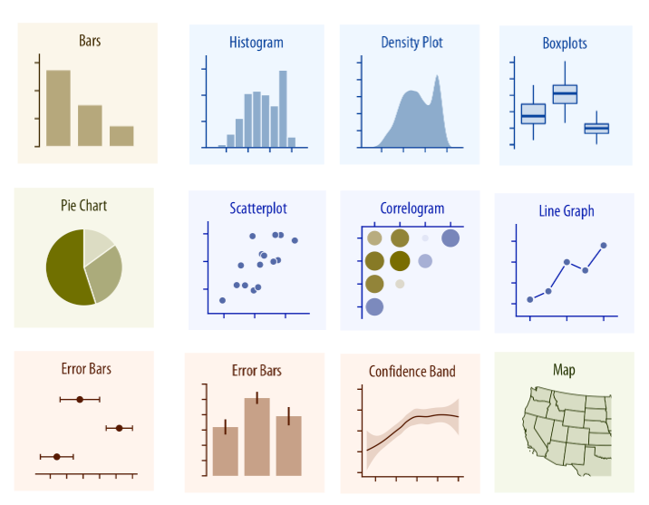
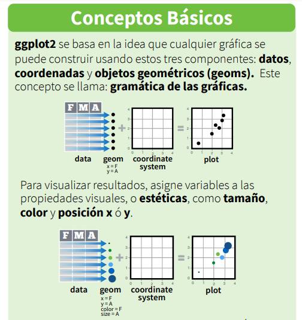
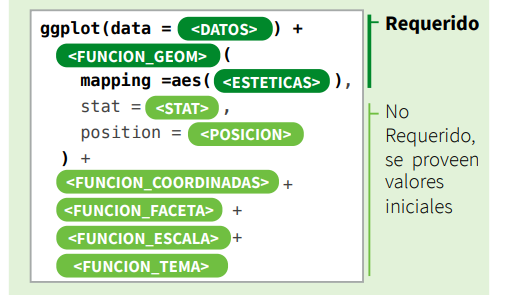

## Transformar &rarr; Visualizar

 

{fig-align="center"}

> "Conviva con sus datos antes de sumergirse en el modelamiento." — Leo Breiman

## Exploración de datos

{fig-align="center"}

> "El mayor valor de un gráfico es cuando nos obliga a notar lo que nunca esperábamos ver." — John Tukey

## "El mejor gráfico de la historia" - [Edward Tufte](https://es.wikipedia.org/wiki/Edward_Tufte)

{fig-align="center"}

::: footer
[Fuente: *Napoleon's march*](https://www.edwardtufte.com/product/napoleons-march/)
::: 

## Directorio de gráficos

::: columns

::: {.column width="50%"}

### 1. Cantidades

### 2. Distribuciones

### 3. Proporciones

### 4. Relaciones *x - y*

### 5. Datos geoespaciales

### 6. Incertidumbre

:::

::: {.column width="50%"}

{fig-align="center"}

:::

:::

::: footer
[Fuente: *capítulo 5 Fundamentals of Data Visualization*](https://clauswilke.com/dataviz/directory-of-visualizations.html)
::: 

## Antes de hacer un gráfico...

{fig-align="center"}

## Guías de visualización

{fig-align="center"}

- [The R Graph Gallery](https://r-graph-gallery.com/)
- [The Python Graph Gallery](https://python-graph-gallery.com/)
- [Proyecto *from Data to Viz*](https://www.data-to-viz.com/)

::: footer
[Fuente: *Data Visualization Infographic: How to Make Charts and Graphs*](https://www.tapclicks.com/resources/blog/guided-visualization)
::: 

# Visualización con R  {background-color="#23373B"}  

## Bibliotecas para visualización

- [`esquisse`](https://dreamrs.github.io/esquisse/)
- [`DataExplorer`](https://boxuancui.github.io/DataExplorer/)

###  `ggplot2`

{fig-align="center"}

[La gramática de gráficos en capas (artículo Hadley Wickham)](http://vita.had.co.nz/papers/layered-grammar.pdf)

[Capítulo 3 R for Data Science - Visualización de datos](https://es.r4ds.hadley.nz/03-visualize.html)

## ¿Cómo funciona `ggplot2`?

::: columns

::: {.column width="50%"}
{fig-align="center"}
:::

::: {.column width="50%"}
 
 
{fig-align="center"}

- [Guía rápida `ggplot2`](https://diegokoz.github.io/intro_ds/fuentes/ggplot2-cheatsheet-2.1-Spanish.pdf)

:::

:::

# Tipos de gráficos: `ggplot2` {background-color="#23373B"} 

## 

::: columns

::: {.column width="50%"}

- **Una variable:**
  - **Variable cuantitativa:**
    - Histogramas `->` `geom_histogram()`
    - Densidades `->` `geom_density()`
    - Cuantil-cuantil (*Q-Q Norm*) `->` `geom_qq()` y `geom_qq_line()`
    - Boxplot `->` `geom_boxplot()`
  - **Variable cualitativa:**
    - Diagrama de barras `->` `geom_bar()`
    - Diagrama de sectores `->` `geom_bar()`
    
- **Dos variables cuantitativas:**
  - Diagrama de dispersión `->` `geom_point()`
  - Tendencias `->` `geom_smooth()`
:::

::: {.column width="50%"}
- **Dos variables cualitativas:**
  - Diagrama puntos superpuestos `->` `geom_count()`
  
- **Dos variables - cuantitativa y cualitativa:**
  - Diagrama de barras `->` `geom_col()`
  - Boxplot `->` `geom_boxplot()`

- **Dos variables - cuantitativa y tiempo:**
  - Diagrama de líneas `->` `geom_line()`
  - Diagrama de área `->` `geom_area()`
  
- **Visualizando incertidumbre:**
  - Barras de errores `->` `geom_errorbar()` 
:::

:::

# Visualización interactiva  {background-color="#23373B"}   

- [Plotly Open Source Graphing Library for Python](https://plotly.com/python/)
- [Plotly Express in Python](https://plotly.com/python/plotly-express/)
- [Plotly R Open Source Graphing Library](https://plotly.com/r/)

{fig-align="center"}

# Paletas de colores  {background-color="#23373B"}  

::: columns

::: {.column width="50%"}

- [Coolors](https://coolors.co/b5fca2-b1b695-a690a4-5e4b56-afd2e9)
- [Color Hunt](https://colorhunt.co/)
- [Canva](https://www.canva.com/colors/color-palette-generator/)

::: 

::: {.column width="50%"}

- [Paletton](https://paletton.com/#uid=52j0u0kllllaFw0g0qFqFg0w0aF)
- [ColorBrewer2](https://colorbrewer2.org/#type=sequential&scheme=PuBu&n=3)

:::

:::

{fig-align="center"}

::: footer
[Fuente: *Teoría del Color*](https://www.significados.com/teoria-del-color/)
::: 

## {background-color="#23373B"}  
 

🤝🙂🤝

 

{fig-align="center"}