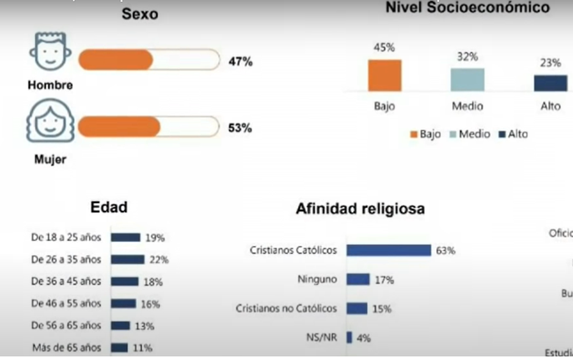
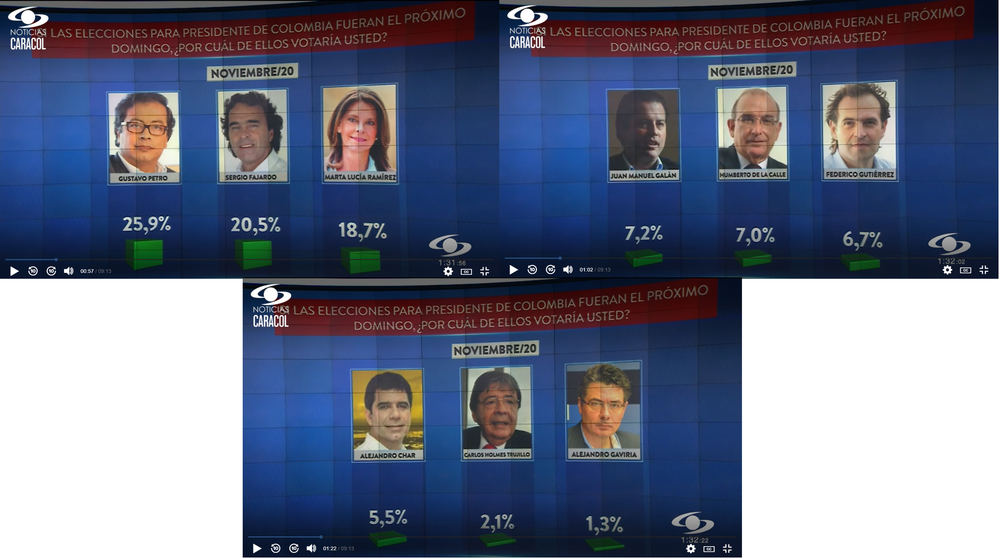
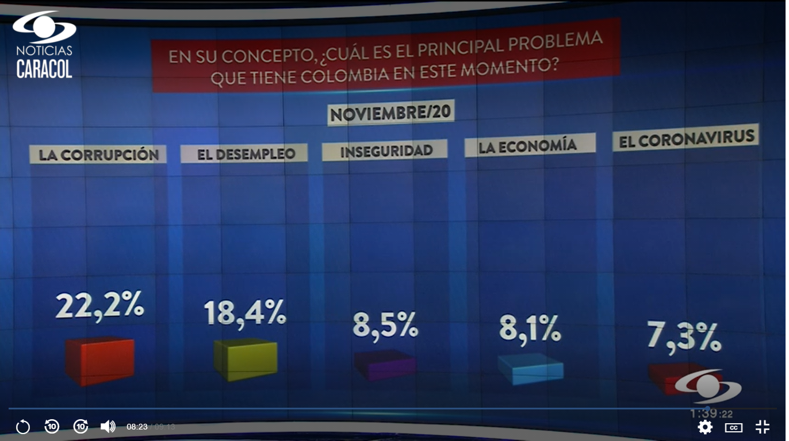
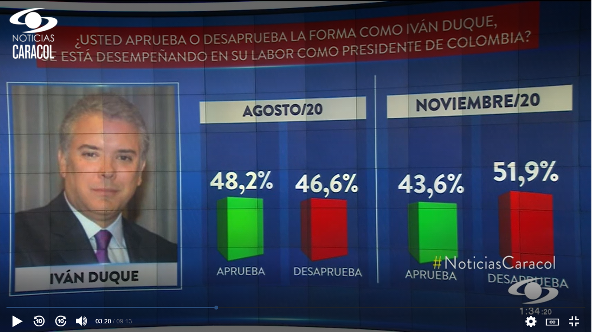

## *"La mejor gráfica de la historia"* — Edward Tufte
<html>

</html> 

{fig-align="center"}

## ¿Cuál es el propósito de un gráfico?

::: columns

::: {.column width="50%"}

### [John W. Tukey](https://es.wikipedia.org/wiki/John_W._Tukey)

{fig-align="center"}

> *“Un simple gráfico ha brindado más información a la mente del analista de datos que cualquier otro dispositivo”*

:::

::: {.column width="50%"}

- Mejorar la compresión de los datos, es decir, que no confunden ni engañan.   
- Explorar y aprender acerca de la información recopilada.    
- Facilitar la comunicación de hallazgos e ideas a otras personas.    
- Búsqueda de patrones ocultos:   
  - Tendencias
  - Relaciones
  - Agrupaciones

#### ¿Todos los gráficos son buenos?

- **Respuesta:** ¡Noooo! [¡Los gráficos circulares  apestan!](https://medium.com/the-mission/to-pie-charts-3b1f57bcb34a)
- **Respuesta de [Edward Tufte](https://www.edwardtufte.com/tufte/):** *"el único diseño peor que un gráfico circular son varios de ellos"*.

:::

:::

# [Gráficos engañosos](https://es.qaz.wiki/wiki/Misleading_graph)

## Características

::: columns

::: {.column width="50%"}
- Omitir la línea de base

{fig-align="center"}

- Manipular el eje Y

{fig-align="center"}

- Ir en contra de las convenciones

{fig-align="center"}

:::

::: {.column width="50%"}

- Datos "amañados"

{fig-align="center"}

- Usando el gráfico incorrecto

{fig-align="center"}

- Más ejemplos de gráficos engañosos:
  - [Misleading Graphs: Real Life Examples](https://www.statisticshowto.com/misleading-graphs/)
  - [Stopping COVID-19 with Misleading Graphs](https://towardsdatascience.com/stopping-covid-19-with-misleading-graphs-6812a61a57c9)
  - [13 Graphs That Are Clearly Lying](https://www.buzzfeednews.com/article/katienotopoulos/graphs-that-lied-to-us)
  - [Misleading Graphs and Statistics](https://faculty.atu.edu/mfinan/2043/section31.pdf)

:::

:::

## Gráficos engañosos: Colombia

{fig-align="center"}

{fig-align="center"}

## Gráficos engañosos: Colombia

{fig-align="center"}

{fig-align="center"}

## Gráficos engañosos: Colombia

{fig-align="center"}

{fig-align="center"}

## Gráficos engañosos: Colombia

{fig-align="center"}

{fig-align="center"}

## Gráficos engañosos: Colombia

{fig-align="center"}

{fig-align="center"}

## Gráficos engañosos: Colombia

{fig-align="center"}

{fig-align="center"}

## Gráficos engañosos: Colombia

{fig-align="center"}

## Gráficos engañosos: Colombia

{fig-align="center"}

{fig-align="center"}

## Gráficos engañosos: Colombia (2020)

{fig-align="center"}

{fig-align="center"}

## Gráficos engañosos: Colombia (2020)

{fig-align="center"}

{fig-align="center"}

## 
 

🤝🙂🤝

 

{fig-align="center"}