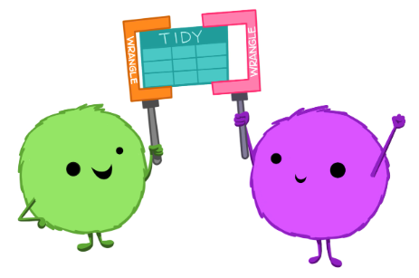
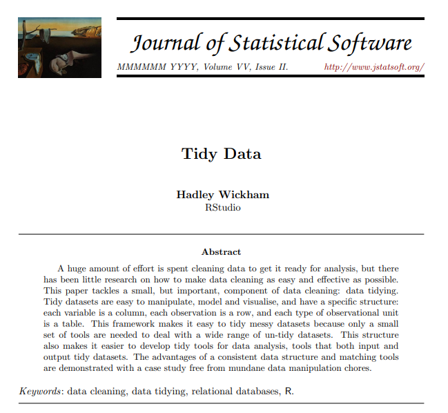
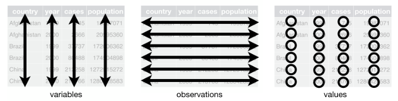

## 

::: rows
::: {.row height="30%"}
{fig-align="center" width=60%}

:::
::: {.row height="70%"}
{fig-align="center" width=35%}
:::
:::

::: footer
Fuente de imagen: [*Tidy data for efficiency, reproducibility, and collaboration*](https://openscapes.org/blog/2020-10-12-tidy-data/)
:::

## *Tidy Data*

::: columns
::: {.column width="70%"}
{width="75%"}
:::

::: {.column width="30%"}

 

:::

:::

::: footer
Artículo: [*Tidy Data*](https://vita.had.co.nz/papers/tidy-data.pdf)
::: 

## ⚠️🤔

{fig-align="center" width="90%"}

::: footer
Fuente de imagen: [*Tidy data for efficiency, reproducibility, and collaboration*](https://openscapes.org/blog/2020-10-12-tidy-data/)
:::

## Principios del *Tidy Data*

::: incremental

- Cada variable es una columna 
- Cada fila es una observación
- Cada celda es un valor

:::

{fig-align="center" width="90%"}

::: footer
Fuente de imagen: [*R for Data Science (2e) - Chapter 5*](https://r4ds.hadley.nz/data-tidy.html)
::: 

## Ejemplo 1: variables en los nombres de las columnas (1/2) {.smaller}

{fig-align="center" width="50%"}

::: incremental

- [Costos Fedearroz](https://fedearroz.com.co/es/fondo-nacional-del-arroz/investigaciones-economicas/estadisticas-arroceras/costos/)
- [Datos del Banco Mundial](https://datos.bancomundial.org/indicador)

:::

::: footer
Fuente de imagen: [*R for Data Science (2e) - Chapter 5*](https://r4ds.hadley.nz/data-tidy.html)
::: 

## Ejemplo 2: variables en los nombres de las columnas (2/2) {.smaller}

::: columns
::: {.column width="50%"}
{fig-align="center" width="90%"}
:::
::: {.column width="50%"}
{fig-align="center" width="90%"}
:::
:::

::: incremental

- [Inventario de Ganado Bovino - Boyacá](https://www.datos.gov.co/Agricultura-y-Desarrollo-Rural/Inventario-de-Ganado-Bovino-DEPARTAMENTO-DE-BOYAC-/4wtf-sdh2/about_data)
- [Inventario Poblacional Del Ganado Bovino Valle del Cauca](https://www.datos.gov.co/Agricultura-y-Desarrollo-Rural/Inventario-Poblacional-Del-Ganado-Bovino-Valle-del/65mn-ybz5/about_data)
- [Inventario anual de Bovinos en Antioquia desde 2000](https://www.datos.gov.co/Agricultura-y-Desarrollo-Rural/Inventario-anual-de-Bovinos-en-Antioquia-desde-200/fy9z-8zxt/about_data)

:::

::: footer
Fuente de imagen: [*R for Data Science (2e) - Chapter 5*](https://r4ds.hadley.nz/data-tidy.html)
:::

## Ejemplo 3: múltiples tablas para una misma unidad experimental {.smaller}

{fig-align="center" width="60%"}

::: incremental

- Raíces Bulbos y Tubérculos en el departamento del Valle del Cauca:
  -  [Superficie Sembrada](https://www.datos.gov.co/Agricultura-y-Desarrollo-Rural/Superficie-Sembrada-con-Ra-ces-Bulbos-y-Tub-rculos/h7vs-gf6t/about_data)
  - [Superficie Cosechada](https://www.datos.gov.co/Agricultura-y-Desarrollo-Rural/Superficie-Cosechada-con-Ra-ces-Bulbos-y-Tub-rculo/2uev-8vbt/about_data)
  - [Producción en Toneladas](https://www.datos.gov.co/Agricultura-y-Desarrollo-Rural/Producci-n-en-Toneladas-por-Hect-reas-de-Ra-ces-Bu/hg7h-itmt/about_data)
  - [Rendimiento en toneladas por hectárea](https://www.datos.gov.co/Agricultura-y-Desarrollo-Rural/Rendimiento-en-toneladas-por-hect-reas-en-Cultivos/239z-ikj9/about_data)

:::

::: footer
Fuente de imagen: [*Merge Multiple Excel Files into One using REST API in Node.js*](https://blog.groupdocs.cloud/merger/merge-multiple-excel-files-into-one-using-rest-api-in-node-js/)
:::

## En conclusión...

{fig-align="center" width="85%"}

## Biblioteca [`tidyr`](https://tidyr.tidyverse.org/)

{fig-align="center" width="50%"}

## 
 

🤝🙂🤝

 

{fig-align="center"}